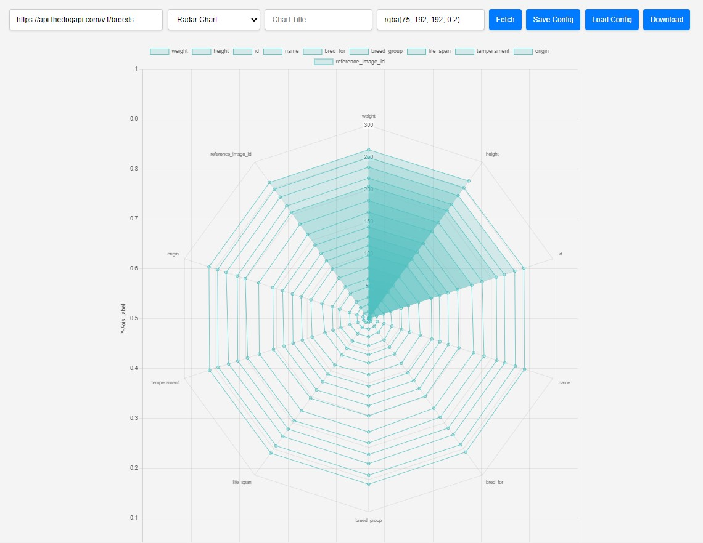

# RevCharts

**DynamicChart Component**
The DynamicChart component provides a flexible and interactive charting solution using Chart.js and Vue.js. It allows users to fetch data from an API, configure chart settings, and save/load configurations.

**Features**
- **Fetch Data from API**: This Vue 3 library dynamically creates and updates Charts based on API calls.
- **Input field for entering an API URL**: Fetches data from the provided URL and visualizes it as a chart.
- **Chart Type Selection**: Dropdown menu to select from various chart types:
Bar Chart
Line Chart
Pie Chart
Doughnut Chart
Radar Chart
Polar Area Chart
Chart Configuration

- **Title**: Input field for setting the chart title.
- **Customize Color**: Input field for specifying the chart color (in RGBA format).
- **Save and Load Configuration**: Save current chart configuration (API URL, chart type, title, color) to localStorage.
- **Load Configuration**: Load saved chart configuration from localStorage.
- **Retry**: Retry button to attempt fetching data again if the initial attempt fails.
- **Download Chart**: Download the displayed chart as a PNG image.
- **Error Handling**: Shows error messages if data fetching fails or if the data format is invalid.
- **Responsive Design**: The chart and controls are responsive and adapt to different screen sizes.

## Screenshot




## Installation

```sh
npm i dynamiccharts

import dynamiccharts from 'dynamiccharts'
import "dynamiccharts/dist/style.css";

<dynamiccharts />

give any Json Api Address in checkbox like this 'https://jsonplaceholder.typicode.com/posts' and click Fetch


